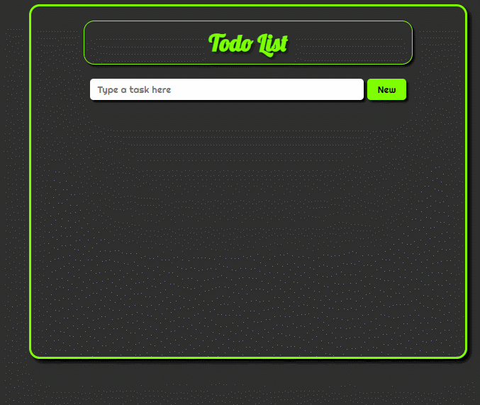

<h1 class = 'titles'>React JS Todo List</h1>

Access by: https://renato-dantas.github.io/todoList/

<h3>This project was created based on the project from <strong>ProgramadorBr Web Developer Course</strong></h3>

 

<h2>Technologies</h2>

This app was created using <strong>React JS</strong> with Hooks and Functional programming.

<h2>How to use</h2>

Write a task and a new field, with this task, will be created, adding a button (on left) to mark the <strong>task done</strong> and another button (on right) to <strong>delete</strong> the task.

All tasks are <strong>stored in the navigator memory</strong> and they are still there if you need to recharge the page.

<h2> Please try yourself in:</h2> 

<a href = 'https://renato-dantas.github.io/todoList/' target = '_blank'>Click here to access the application</a> 

 
  
  
  

